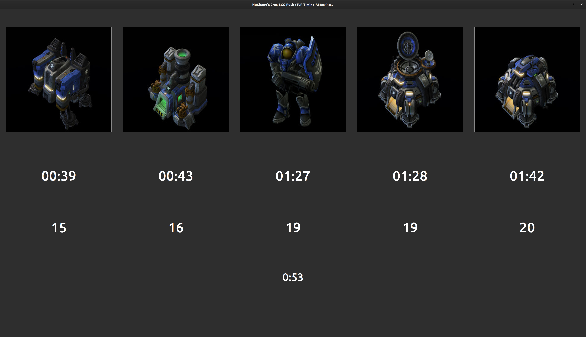

# Build_order_display_sc2

## Image



## Install

You have to install `tkinter` and `pynput` on your computer

## Make a bo

To make your own build order, you have to create a list of list on the main.py file.

For example, a terran BO:

```

# BoTime(minutes, seconds), ex: BoTime(2, 34) -> 2min and 34s
# The next number is the supply that you have to make the unit/building/upgrade.

TerranBO = [
	[BoTime(0, 2), 21, Terran.Structure.Barracks], # [(minutes, seconds), supply, type]
	[BoTime(0, 44), 28, Terran.Units.Marine], 
	[BoTime(1, 12), 29, Terran.Upgrade.StimPack],
]

```

Next, you have to change the penultimate line:

```
app = ImageChangerApp(root, bo1) -> app = ImageChangerApp(root, TerranBO)
```

## To Run

You have to execute the `main.py` file

```
python3 main.py
```

# To Do

- Add zerg upgrade
- Add image upgrade of better quality
- Continue to correct some bug
- Make easier the processus of build order creation
