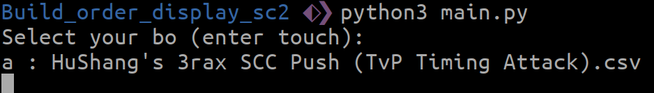

# Build_order_display_sc2

## Image

## Install

You have to install `tkinter` and `pynput` on your computer

## How to use

### Make a Bo

To make a bo, have to choose (or create) a build order on [lotv spawningtool](https://lotv.spawningtool.com).

Next, your run the file `LotvToBo.py` by run `python3 LotvToBo.py`.
After, your copy the build order and put a filename from the lotv web site (see on the image).

### Run the app

Now, you run the `main.py` app by `python3 main.py`, then you select the build order :

Finally, press `right ctrl` when the game is launch. End !

# To Do

- Add image upgrade of better quality				(0/100)
- Make easier the processus of build order creation		(40/100)
- Continue to correct some bug
- Merge the LotvToBo.py and main.py files to only one file (0/100)
